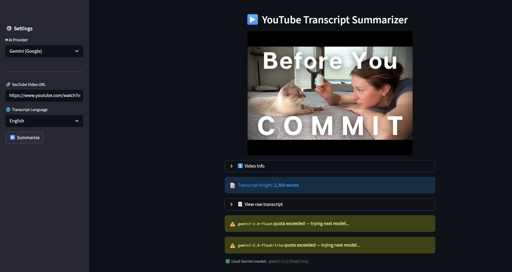
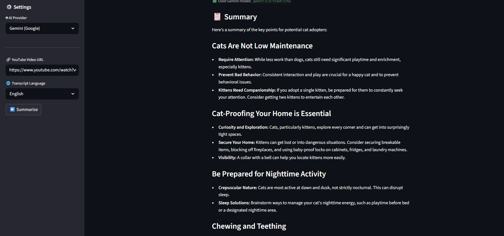
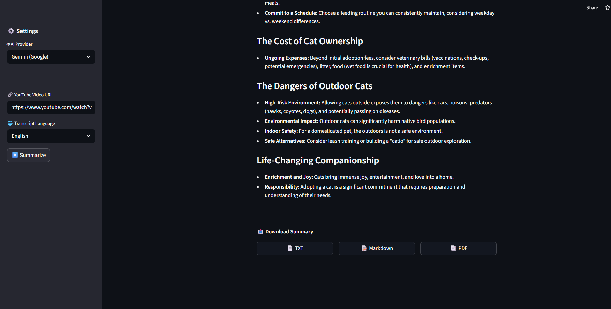

# 🎬 YouTube Transcript Summarizer (GenAI Powered)

Turn any YouTube video into a clean, structured summary in seconds.

---

## 🚀 Live Features

A powerful AI web app that:

* Extracts transcripts from YouTube videos
* Handles missing / auto-generated subtitles
* Generates structured summaries using GenAI
* Provides downloadable outputs (TXT, Markdown, PDF)

---

## ✨ Key Highlights

### ⚡ Smart Transcript Extraction

* Works with **manual + auto-generated subtitles**
* Handles failures gracefully with fallback logic
* Supports multiple languages

---

### 🤖 Multi-Model AI System

* Integrated with **OpenRouter**
* Automatically switches models when limits are hit
* Ensures **zero downtime summarization**

---

### 🧠 Structured AI Summaries

* Clean headings
* Bullet-point insights
* Easy-to-read format

---

### 📊 Rich UI Experience

* Video thumbnail preview
* Transcript length indicator
* Expandable raw transcript view
* Real-time model fallback alerts

---

### 📥 Export Options

Download summaries in:

* TXT
* Markdown
* PDF

---

## 🏗️ System Architecture

```id="arch1"
User Input (YouTube URL)
        ↓
Video ID Extraction
        ↓
Transcript Pipeline
   ├── LangChain YoutubeLoader
   ├── Auto-generated subtitles
   └── Fallback handling
        ↓
GenAI Layer (OpenRouter)
   ├── Model 1 (Primary)
   ├── Model 2 (Fallback)
   └── Model 3 (Backup)
        ↓
Structured Summary Output
        ↓
Download (TXT / MD / PDF)
```

---

## 🧰 Tech Stack

* **Frontend**: Streamlit
* **AI Layer**: OpenRouter (multi-model routing)
* **Transcript Extraction**: LangChain + YouTube APIs
* **LLMs Used**: Gemini / others via OpenRouter
* **Environment**: Python + dotenv

---

## ⚙️ Setup

```bash
git clone https://github.com/your-username/youtube-summarizer.git
cd youtube-summarizer
pip install -r requirements.txt
```

Create `.env` file:

```env
OPENROUTER_API_KEY=your_key
GOOGLE_API_KEY=your_key
```

Run app:

```bash
streamlit run app.py
```

---

## ▶️ How to Use

1. Paste a YouTube URL
2. Select transcript language
3. Click **Summarize**
4. View structured summary
5. Download in preferred format





---

## ⚠️ Real-World Handling

This app is designed for **real conditions**, not ideal cases:

* Handles missing transcripts
* Works with auto-generated captions
* Recovers from API limits
* Switches models dynamically

---

## 🔮 Future Enhancements

* 💬 Chat with video (RAG)
* ⏱️ Timestamp-based summaries
* 🎯 Summary modes (Quick / Detailed / Bullet)
* 🌍 Auto-translation
* ☁️ Deployment (Streamlit Cloud / AWS)

---

## 🧠 Why This Project Stands Out

Most summarizers:

> ❌ Break when transcripts fail
> ❌ Stop when API limits hit

This one:

> ✅ Adapts
> ✅ Recovers
> ✅ Keeps working

---

---
